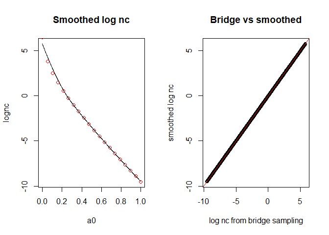

<!-- README.md is generated from README.Rmd. Please edit that file -->

# glmnpp

<!-- badges: start -->

[](https://github.com/ethan-alt/glmnpp/actions)
<!-- badges: end -->

The goal of glmnpp is to make user-friendly functions to ease in
sampling from the posterior distribution using the normalized power
prior for GLMs.

## Installation

You can install the development version of glmnpp from
[GitHub](https://github.com/) with:

``` r
# install.packages("devtools")
devtools::install_github("ethan-alt/glmnpp")
```

Note that the package takes quite a long time to install (around 10
minutes on a local machine).

## Example

Below, we present an example of how the package may be used for a
logistic regression model. We begin by simulating the current and
historical data sets.

``` r
library(glmnpp)
set.seed(123)
n  = 30
n0 = 20
x  = rnorm(n)
x0 = rnorm(n0)
y  = rbinom(n = n,  size = 1, prob = binomial()$linkinv(1 - 0.5 * x) )
y0 = rbinom(n = n0, size = 1, prob = binomial()$linkinv(1 - 0.5 * x0) )
data = data.frame('y' = y, 'x' = x)
histdata = data.frame('y' = y0, 'x' = x0)
```

We now estimate the logarithm of the normalizing constant

``` r
## Estimate logarithm of normalizing constant using bridge sampling;
##   refresh = 0 is a rstan::sampling argument that suppresses console
##   output
bridge = glm_npp_lognc(
  y ~ x, binomial(), histdata, a0.n = 20, method = 'bridge', refresh = 0
)
#> Iteration: 1
#> Iteration: 2
#> Iteration: 3
#> Iteration: 4
#> Iteration: 1
#> Iteration: 2
#> Iteration: 3
#> Iteration: 4
#> Iteration: 5
#> Iteration: 1
#> Iteration: 2
#> Iteration: 3
#> Iteration: 4
#> Iteration: 1
#> Iteration: 2
#> Iteration: 3
#> Iteration: 4
#> Iteration: 5
#> Iteration: 1
#> Iteration: 2
#> Iteration: 3
#> Iteration: 4
#> Iteration: 5
#> Iteration: 1
#> Iteration: 2
#> Iteration: 3
#> Iteration: 4
#> Iteration: 1
#> Iteration: 2
#> Iteration: 3
#> Iteration: 4
#> Iteration: 5
#> Iteration: 1
#> Iteration: 2
#> Iteration: 3
#> Iteration: 4
#> Iteration: 5
#> Iteration: 1
#> Iteration: 2
#> Iteration: 3
#> Iteration: 4
#> Iteration: 1
#> Iteration: 2
#> Iteration: 3
#> Iteration: 4
#> Iteration: 1
#> Iteration: 2
#> Iteration: 3
#> Iteration: 4
#> Iteration: 5
#> Iteration: 1
#> Iteration: 2
#> Iteration: 3
#> Iteration: 4
#> Iteration: 5
#> Iteration: 1
#> Iteration: 2
#> Iteration: 3
#> Iteration: 4
#> Iteration: 5
#> Iteration: 1
#> Iteration: 2
#> Iteration: 3
#> Iteration: 4
#> Iteration: 5
#> Iteration: 1
#> Iteration: 2
#> Iteration: 3
#> Iteration: 4
#> Iteration: 5
#> Iteration: 1
#> Iteration: 2
#> Iteration: 3
#> Iteration: 4
#> Iteration: 1
#> Iteration: 2
#> Iteration: 3
#> Iteration: 4
#> Iteration: 5
#> Iteration: 1
#> Iteration: 2
#> Iteration: 3
#> Iteration: 4
#> Iteration: 5
#> Iteration: 6
#> Iteration: 1
#> Iteration: 2
#> Iteration: 3
#> Iteration: 4
#> Iteration: 5
#> Iteration: 1
#> Iteration: 2
#> Iteration: 3
#> Iteration: 4
#> Iteration: 5
head(bridge)
#>           a0      lognc
#> 1 0.00000000  6.4420156
#> 2 0.05263158  3.8138954
#> 3 0.10526316  2.4854350
#> 4 0.15789474  1.4597925
#> 5 0.21052632  0.5757172
#> 6 0.26315789 -0.2356078
```

We can then obtain a smooth estimate of the normalizing constant using
`loess`

``` r
lognc.loess   = loess(lognc ~ a0, data = bridge)
a0.data       = data.frame('a0' = seq(0, 1, length.out = 1000))
a0.data$lognc = predict(lognc.loess, newdata = a0.data)
par(mfrow = c(1, 2))
plot(x = a0.data$a0, y = a0.data$lognc, type = 'l', ylab = 'lognc', xlab = 'a0',
     main = "Smoothed log nc")
points(x = bridge$a0, y = bridge$lognc, col = 'red')
plot(x = a0.data$lognc, y = predict(lognc.loess, newdata = a0.data$a0),
     xlab = "log nc from bridge sampling",
     ylab = "smoothed log nc",
     main = "Bridge vs smoothed"
)
abline(a = 0, b = 1, col = 'red') ## 45 degree line
```



``` r
par(mfrow = c(1, 1))
```

The smoothing seems to have done a decent job at predicting the log
normalizing constant, so we proceed. We now incorporate the smoothed
estimate of the log normalizing constant into the posterior distribution

``` r
fit.post = glm_npp(y ~ x, binomial(), data, histdata, a0.lognc = a0.data)
#> 
#> SAMPLING FOR MODEL 'glm_pp_bernoulli_post' NOW (CHAIN 1).
#> Chain 1: 
#> Chain 1: Gradient evaluation took 0 seconds
#> Chain 1: 1000 transitions using 10 leapfrog steps per transition would take 0 seconds.
#> Chain 1: Adjust your expectations accordingly!
#> Chain 1: 
#> Chain 1: 
#> Chain 1: Iteration:    1 / 2000 [  0%]  (Warmup)
#> Chain 1: Iteration:  200 / 2000 [ 10%]  (Warmup)
#> Chain 1: Iteration:  400 / 2000 [ 20%]  (Warmup)
#> Chain 1: Iteration:  600 / 2000 [ 30%]  (Warmup)
#> Chain 1: Iteration:  800 / 2000 [ 40%]  (Warmup)
#> Chain 1: Iteration: 1000 / 2000 [ 50%]  (Warmup)
#> Chain 1: Iteration: 1001 / 2000 [ 50%]  (Sampling)
#> Chain 1: Iteration: 1200 / 2000 [ 60%]  (Sampling)
#> Chain 1: Iteration: 1400 / 2000 [ 70%]  (Sampling)
#> Chain 1: Iteration: 1600 / 2000 [ 80%]  (Sampling)
#> Chain 1: Iteration: 1800 / 2000 [ 90%]  (Sampling)
#> Chain 1: Iteration: 2000 / 2000 [100%]  (Sampling)
#> Chain 1: 
#> Chain 1:  Elapsed Time: 0.045 seconds (Warm-up)
#> Chain 1:                0.055 seconds (Sampling)
#> Chain 1:                0.1 seconds (Total)
#> Chain 1: 
#> 
#> SAMPLING FOR MODEL 'glm_pp_bernoulli_post' NOW (CHAIN 2).
#> Chain 2: 
#> Chain 2: Gradient evaluation took 0 seconds
#> Chain 2: 1000 transitions using 10 leapfrog steps per transition would take 0 seconds.
#> Chain 2: Adjust your expectations accordingly!
#> Chain 2: 
#> Chain 2: 
#> Chain 2: Iteration:    1 / 2000 [  0%]  (Warmup)
#> Chain 2: Iteration:  200 / 2000 [ 10%]  (Warmup)
#> Chain 2: Iteration:  400 / 2000 [ 20%]  (Warmup)
#> Chain 2: Iteration:  600 / 2000 [ 30%]  (Warmup)
#> Chain 2: Iteration:  800 / 2000 [ 40%]  (Warmup)
#> Chain 2: Iteration: 1000 / 2000 [ 50%]  (Warmup)
#> Chain 2: Iteration: 1001 / 2000 [ 50%]  (Sampling)
#> Chain 2: Iteration: 1200 / 2000 [ 60%]  (Sampling)
#> Chain 2: Iteration: 1400 / 2000 [ 70%]  (Sampling)
#> Chain 2: Iteration: 1600 / 2000 [ 80%]  (Sampling)
#> Chain 2: Iteration: 1800 / 2000 [ 90%]  (Sampling)
#> Chain 2: Iteration: 2000 / 2000 [100%]  (Sampling)
#> Chain 2: 
#> Chain 2:  Elapsed Time: 0.056 seconds (Warm-up)
#> Chain 2:                0.05 seconds (Sampling)
#> Chain 2:                0.106 seconds (Total)
#> Chain 2: 
#> 
#> SAMPLING FOR MODEL 'glm_pp_bernoulli_post' NOW (CHAIN 3).
#> Chain 3: 
#> Chain 3: Gradient evaluation took 0 seconds
#> Chain 3: 1000 transitions using 10 leapfrog steps per transition would take 0 seconds.
#> Chain 3: Adjust your expectations accordingly!
#> Chain 3: 
#> Chain 3: 
#> Chain 3: Iteration:    1 / 2000 [  0%]  (Warmup)
#> Chain 3: Iteration:  200 / 2000 [ 10%]  (Warmup)
#> Chain 3: Iteration:  400 / 2000 [ 20%]  (Warmup)
#> Chain 3: Iteration:  600 / 2000 [ 30%]  (Warmup)
#> Chain 3: Iteration:  800 / 2000 [ 40%]  (Warmup)
#> Chain 3: Iteration: 1000 / 2000 [ 50%]  (Warmup)
#> Chain 3: Iteration: 1001 / 2000 [ 50%]  (Sampling)
#> Chain 3: Iteration: 1200 / 2000 [ 60%]  (Sampling)
#> Chain 3: Iteration: 1400 / 2000 [ 70%]  (Sampling)
#> Chain 3: Iteration: 1600 / 2000 [ 80%]  (Sampling)
#> Chain 3: Iteration: 1800 / 2000 [ 90%]  (Sampling)
#> Chain 3: Iteration: 2000 / 2000 [100%]  (Sampling)
#> Chain 3: 
#> Chain 3:  Elapsed Time: 0.05 seconds (Warm-up)
#> Chain 3:                0.044 seconds (Sampling)
#> Chain 3:                0.094 seconds (Total)
#> Chain 3: 
#> 
#> SAMPLING FOR MODEL 'glm_pp_bernoulli_post' NOW (CHAIN 4).
#> Chain 4: 
#> Chain 4: Gradient evaluation took 0 seconds
#> Chain 4: 1000 transitions using 10 leapfrog steps per transition would take 0 seconds.
#> Chain 4: Adjust your expectations accordingly!
#> Chain 4: 
#> Chain 4: 
#> Chain 4: Iteration:    1 / 2000 [  0%]  (Warmup)
#> Chain 4: Iteration:  200 / 2000 [ 10%]  (Warmup)
#> Chain 4: Iteration:  400 / 2000 [ 20%]  (Warmup)
#> Chain 4: Iteration:  600 / 2000 [ 30%]  (Warmup)
#> Chain 4: Iteration:  800 / 2000 [ 40%]  (Warmup)
#> Chain 4: Iteration: 1000 / 2000 [ 50%]  (Warmup)
#> Chain 4: Iteration: 1001 / 2000 [ 50%]  (Sampling)
#> Chain 4: Iteration: 1200 / 2000 [ 60%]  (Sampling)
#> Chain 4: Iteration: 1400 / 2000 [ 70%]  (Sampling)
#> Chain 4: Iteration: 1600 / 2000 [ 80%]  (Sampling)
#> Chain 4: Iteration: 1800 / 2000 [ 90%]  (Sampling)
#> Chain 4: Iteration: 2000 / 2000 [100%]  (Sampling)
#> Chain 4: 
#> Chain 4:  Elapsed Time: 0.042 seconds (Warm-up)
#> Chain 4:                0.04 seconds (Sampling)
#> Chain 4:                0.082 seconds (Total)
#> Chain 4:
fit.post
#> Inference for Stan model: glm_pp_bernoulli_post.
#> 4 chains, each with iter=2000; warmup=1000; thin=1; 
#> post-warmup draws per chain=1000, total post-warmup draws=4000.
#> 
#>           mean se_mean   sd   2.5%    25%    50%    75%  97.5% n_eff Rhat
#> beta[1]   0.89    0.01 0.38   0.19   0.63   0.88   1.14   1.68  2555    1
#> beta[2]  -0.60    0.01 0.42  -1.45  -0.87  -0.59  -0.33   0.21  2737    1
#> a0        0.53    0.00 0.24   0.11   0.33   0.52   0.73   0.97  2650    1
#> lp__    -23.25    0.03 1.31 -26.66 -23.77 -22.91 -22.29 -21.80  1677    1
#> 
#> Samples were drawn using NUTS(diag_e) at Wed Dec 08 16:42:27 2021.
#> For each parameter, n_eff is a crude measure of effective sample size,
#> and Rhat is the potential scale reduction factor on split chains (at 
#> convergence, Rhat=1).
```
